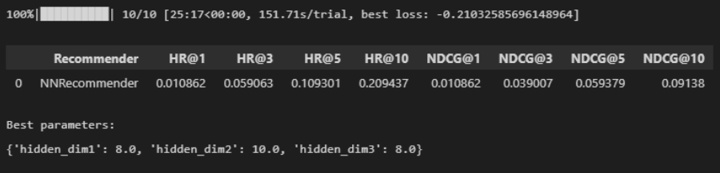

# Report - Project 2: Recommender

### Project description

<h2>Results</h2>

 - Model 1 best result:

 - Model 2 best result:

<h2>The best achieved result params:<h2>

<h4>
<li>n_neg_per_pos=2</li>
<li>hidden_dim1=9
<li>hidden_dim2=6
<li>hidden_dim3=12
<li>n_epochs=30
<li>batch_size = 8000
<li>lr = 0.001
<li>weight_decay=0.0001
</h4>

 
<h2>Summary:</h2>

   <h3>1. Model</h3>
    
   <h4>I decided to make a hybrid model. It's a neural network and content based model.
   First, I was looking for a different models and how they should look like. Then based on models I saw, I created the first model. I made a lot of effort to find perfect paramiters and get nice HR@10 result, but I wanted to make it better then Amazon. When I couldn't find any more better solutions by changing params I decided to change the model itself hoping to make it better. The second model gave me the results I wanted.</h4>
    
   <h3>2. Tuning</h3>
    
   <h4>Tuning was the longest activity in the whole project. Thanks to the optimization, the needed time to achieve a final evoluation was around 2 minutes. Changing and analyzing paramiters took a lot of time. If I could change something I would love to know how every variable affects the recommendation beforehead so I could predict better what to change to improve it. I was learning about it in the process but still there is too much randomness. In most cases auto tuning with randomly drawn values was worse option than changing manualy for a specific values.</h4>
    
   <h3>3. How can the model be further improved? </h3>
    
   <h4>By analizing the data separately to find clues what things are crucial for people while choosing a hotel and it's rooms. What types of data features are best for neural network to learn better and of course create this features. Then it will be needed to examine which of them are best together. For this purpose I could recommend using regression model to see how the data compliments each other and based on the result add chosen features.</h4>
    
   <h4>The second thing which could be improved is the model itself. There are a lot of types of models simpler or more complicated ones. There is a high possibility that some of them will fit better then mine.</h4>
    

<h2>Tuning prove<h2>

<h4>There were more tests while tuning but there is no need for showing them all and comparing.</h4>
